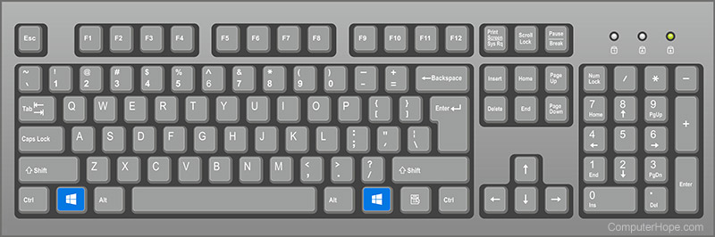

---
tags:
  - '#meeting-notes'
---


# Testseite

## \uD83D\uDDD3 Datum

2025-12-08

## Wie starte ich Comarch?

1. Drücke die Windows-Taste auf deiner Tastatur
2. 

   Suche im Dialog nach `Comarch`

> [!WARNING]
> Achte darauf, dass du die richtige Umgebung (PROD / TEST) öffnest

## \uD83D\uDC65 Teilnehmer

- Janis Huser
- öffne die Anwendung `Comarch`

## \uD83E\uDD45 Ziele

## \uD83C\uDFA8 Brainstorming

## \uD83D\uDDE3 Diskussionsthemen

|  **Zeit**    |  **Thema**    |  **Referent**    |  **Notizen**                                                                                                                                                              |
|:-------------|:--------------|:-----------------|:--------------------------------------------------------------------------------------------------------------------------------------------------------------------------|
| asdf         | asdf          |                  | <ul local-id="6017bfc9-eb5b-4d09-80c4-d799c01fe0c8"><li local-id="e2eee7c3-e461-459e-b14f-dd5af5a846d8"><p local-id="e8541f17-981b-45d6-b3b0-c732745c330e"></p></li></ul> |
|              | asdf          | asdf             | ```java<br/>Hallo<br/>Velo<br/><br/>```                                                                                                                                   |

## ✅ Handlungspunkte


## ⤴ Entscheidungen


## 🗃️ Verwandte Informationen
